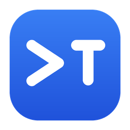
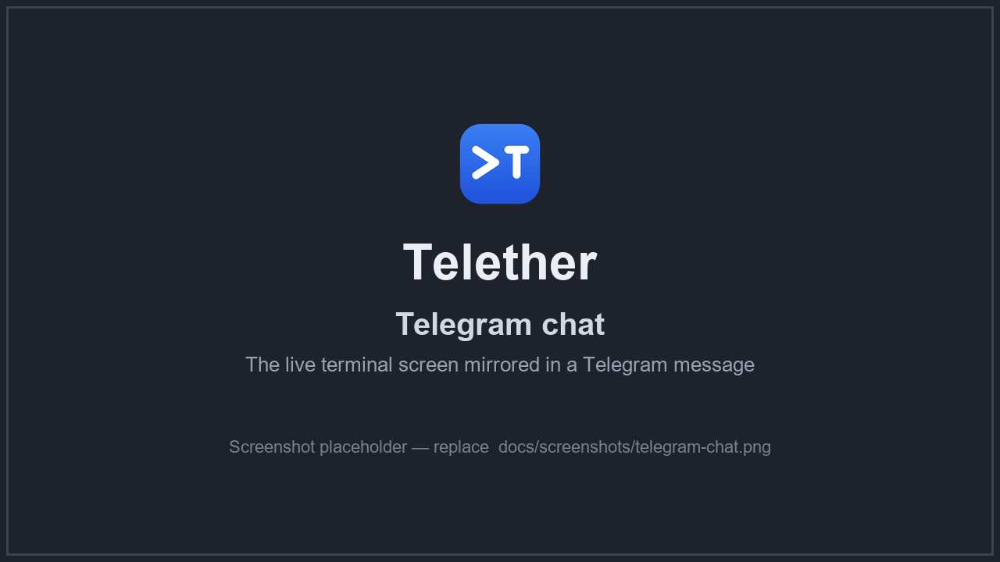
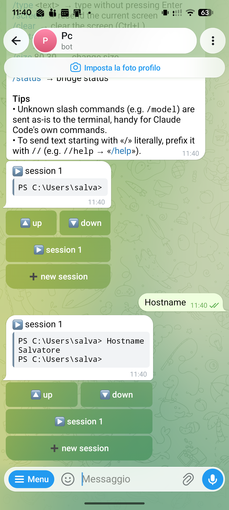
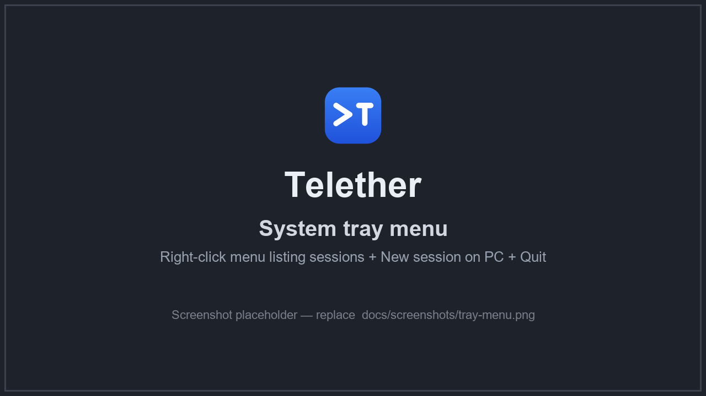
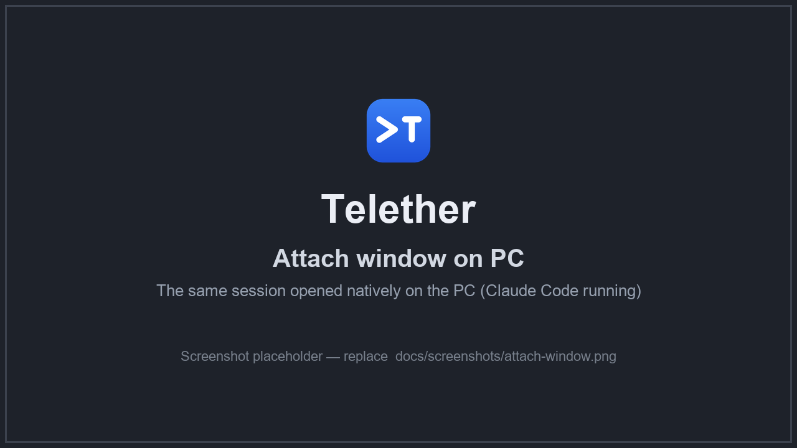
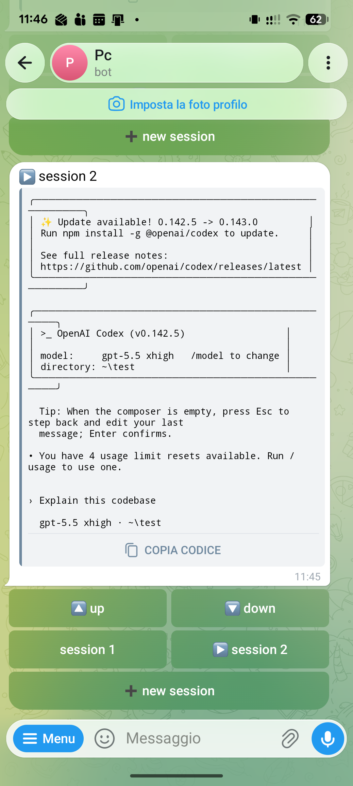

<p align="center">
  
</p>

# Telether — control your Windows terminal from Telegram

**Telether is a lightweight Windows app that bridges a real terminal session to
Telegram, so you can run and control command‑line tools from your phone — from
anywhere.** It was built to drive AI coding agents like **Claude Code** and
**OpenAI Codex CLI** remotely, but it works with any interactive terminal
program: PowerShell, `ssh`, long‑running builds, `npm`, `git`, servers, and more.

> Run **Claude Code** and **Codex** on your PC, keep working from your phone over
> Telegram, then sit back down and pick up the exact same session on your desktop.

<p align="center">
  
</p>


---

## Why Telether?

If you use a terminal‑based AI agent such as **Claude Code CLI** or **Codex CLI**,
you often want to:

- kick off a task on your powerful desktop, then **step away and keep answering
  the agent's prompts from your phone**;
- **check on a long build or a running server** without remoting into the machine;
- approve/deny an agent's actions (`y/n`, arrow‑key menus) while you're away;
- come home and **resume the very same session** natively on the PC.

Telether does exactly this: your Windows terminal, **over Telegram**, with the
same session shared live between your phone and your PC.

## Features

- 🖥️ **Real Windows terminal over Telegram** — a genuine console (ConPTY) mirrored
  live into a Telegram message that updates in place.
- 🤖 **Made for AI CLIs** — first‑class support for **Claude Code** and **Codex**
  (and any full‑screen TUI): arrow keys, Enter, Esc, Tab, `Ctrl+C`, double
  `Ctrl+C` to quit, and more.
- 🔀 **Multiple sessions** with one‑tap switching via inline buttons.
- 🔗 **Attach from your PC** — open the *same* live session natively on your
  desktop (full color, TUIs work), tmux‑style. Works both ways: start on the PC,
  continue on Telegram, and vice versa.
- 🔕 **Silent system‑tray app** — no console window, no notification sounds.
- 🚀 **Autostart on boot**, single‑instance, runs quietly in the background.
- 🌍 **English and Italian** interface (`/lang en` · `/lang it`).
- 🔒 **Private by design** — only chat IDs you authorize can control the machine;
  the local attach channel is bound to `127.0.0.1`.

## Screenshots
  **Telether — Session buttons**
    <p align="center">  
      
    </p>
  **Telether — Tray menu**
    <p align="center">
      
    </p>
  **Telether — Attach window**
    <p align="center">
      
    </p>
  **Telether — Codex**
    <p align="center">
      
    </p>

## How it works

Telether spawns a real Windows console with **ConPTY** (via `pywinpty`), emulates
its screen with `pyte`, and mirrors it into a Telegram chat with
`python-telegram-bot`. Whatever you type in Telegram is sent to the terminal as
keystrokes; the terminal's screen is sent back as a live, monospace message. A
tiny local server lets you also **attach** to the same session from your PC.

## Requirements

- Windows 10 or 11
- Python 3.9+ ([python.org](https://www.python.org/downloads/))
- A free Telegram bot token (from [@BotFather](https://t.me/BotFather))

## Quick start

1. **Clone and install dependencies**

   ```bash
   git clone https://github.com/salvatoregiardina88/telether.git
   cd telether
   ```

   Double‑click **`install.bat`** (or run `pip install -r requirements.txt`).

2. **Create a Telegram bot**

   In Telegram, open **@BotFather**, send `/newbot`, and copy the **token** it
   gives you (looks like `123456789:AAE...`).

3. **Configure**

   Copy `config.example.json` to **`config.json`** and paste your token into
   `"bot_token"`. (You can also just run once and paste it when prompted.)

4. **Run**

   - **`start-silent.bat`** → runs Telether silently with a **system‑tray icon**
     (recommended), or
   - **`start.bat`** → runs with a visible console window (handy for logs).

5. **Pair your phone**

   Open the chat with your bot and send `/start`. The first chat to message the
   bot is authorized automatically and becomes the controller.

6. **Go**

   Type `claude` to launch **Claude Code**, or `codex` for **Codex CLI**, and
   you're driving your terminal from your phone.

## Using Telether

- **Type a normal message** → it is typed into the terminal followed by Enter.
- **Answer menus** with `/up` `/down` `/enter`, confirm with `/type y` then `/enter`.
- **Special keys:** `/enter` `/esc` `/tab` `/space` `/bs` `/del` `/up` `/down`
  `/left` `/right` `/home` `/end` `/pgup` `/pgdn`
- **`/ctrl c`** sends Ctrl+C (also `z`, `d`, `l`, …).
- **`/cc`** sends a **double Ctrl+C** half a second apart — the reliable way to
  **quit Claude Code / Codex**.
- **Scrolling:** use the 🔼/🔽 buttons under the screen, or `/scrollup` /
  `/scrolldown`.
- Unknown slash commands (e.g. `/model`) are forwarded to the terminal as‑is, so
  Claude Code's own slash commands work. To send text starting with `/` literally,
  prefix it with `//` (e.g. `//help` → `/help`).

## Multiple sessions

Keep several terminals open at once (e.g. Claude Code in one, a build in another).
Buttons under the screen let you switch with one tap: **▶** marks the active
session, **•** marks a background session with new output, **➕** creates a new one.

Commands: `/new [name]` · `/sessions` · `/use <n>` · `/close [n]` · `/rename <name>`.

## Attach from your PC (shared session)

The session lives inside Telether, so you can control it **from Telegram and from
your PC at the same time, on the same session**.

With Telether running, right‑click the tray icon and pick a session under **"open
session on PC"**, or run **`attach.bat <n>`**. A native terminal window opens with
the shared session — full color, TUIs working. **Press F12 or close the window to
detach**; the session keeps running.

This means both directions work: start on the PC and continue on Telegram, or
start on Telegram and pick it up on the PC. (The session must be started *through*
Telether — Windows can't attach to a separately‑opened console.)

## Silent tray app & autostart

Run **`start-silent.bat`** for the recommended experience:

- no console window and no notification sounds;
- a **tray icon** whose right‑click menu lists your sessions (click to attach),
  plus **New session on PC** and **Quit**;
- only one instance runs at a time.

Enable **autostart on sign‑in** with **`autostart-on.bat`** (disable with
`autostart-off.bat`). It adds a per‑user entry under
`HKCU\...\CurrentVersion\Run` that launches Telether with `pythonw.exe` (no
window).

## Language

The interface is available in **English** and **Italian**. Set `"language"` to
`"en"` or `"it"` in `config.json`, or switch on the fly with **`/lang en`** /
**`/lang it`**.

## Configuration (`config.json`)

| Field | Meaning |
|---|---|
| `bot_token` | Your Telegram bot token from @BotFather |
| `allowed_chat_ids` | Authorized chat IDs (empty = pairing mode) |
| `language` | `en` or `it` |
| `shell` | Terminal command to launch (default PowerShell) |
| `cwd` | Working directory (empty = your user folder) |
| `cols`, `rows` | Emulated screen size |
| `auto_enter` | If `true`, plain messages are sent with Enter |
| `render_interval` | How often (seconds) to refresh the screen in Telegram |
| `attach_port` | Local port for PC attach (`0` disables attach) |

## Security

Whoever controls the authorized chat has **full access to your PC** with your
permissions. Keep your bot token secret and don't share the bot. Only chat IDs in
`allowed_chat_ids` can control the terminal, and the attach channel is bound to
`127.0.0.1` (local machine only). Your token lives in `config.json`, which is
git‑ignored.

## License

Telether's own code is licensed under the **PolyForm Noncommercial License
1.0.0**:

- ✅ **Free** for personal and other **noncommercial** use.
- 💼 **Commercial use requires a paid license** — contact
  **salvatoregiardina88@gmail.com**.

See [LICENSE.md](LICENSE.md). Third‑party dependencies keep their own licenses —
see [THIRD_PARTY_LICENSES.md](THIRD_PARTY_LICENSES.md).

## FAQ

**Does this work with Claude Code and Codex?** Yes — that's the primary use case.
Type `claude` or `codex` in a session and drive them from Telegram, including
arrow‑key menus and confirmations.

**Is it macOS/Linux too?** Not yet — Telether uses Windows ConPTY. It targets
Windows 10/11.

**When does the session reset?** It persists until Telether stops. It restarts on
reboot (autostart spawns a fresh shell), on `/restart`, or if the shell exits.
Quitting Claude Code with `/cc` returns you to PowerShell in the same session.

**The bot doesn't respond.** Make sure Telether is running (tray icon or
`start.bat`) and the token is correct. Only one instance may run at a time —
running `start.bat` and the tray together triggers a Telegram "Conflict".

---

<sub>Keywords: Windows terminal over Telegram · control your PC from your phone ·
run Claude Code from phone · Codex CLI remote · remote terminal Telegram bot ·
PowerShell over Telegram · ConPTY · mobile terminal · tmux‑style attach · ChatOps.</sub>
